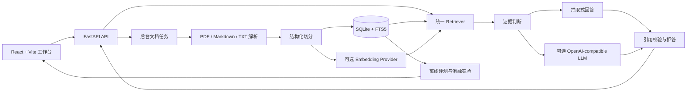

# 课程资料 RAG 智能问答系统

## 项目背景

这是一个面向课程资料的可运行 RAG 系统。用户上传 PDF、Markdown 或 TXT 后，服务会异步解析、结构化切分并建立索引；问答阶段支持 BM25、TF-IDF、Embedding 和 Hybrid 检索，并通过证据阈值、严格引用校验和结构化拒答降低无依据回答。系统同时保存处理、检索、问答和评测记录，并提供 React 评测工作台。

## 仓库核验

项目仓库：[GitHub: clmjan/RAG-](https://github.com/clmjan/RAG-)

简历中的链接必须指向**具体项目仓库**，而不是 GitHub/Gitee 个人主页。发布前请按
[RELEASE_CHECKLIST.md](RELEASE_CHECKLIST.md) 核验仓库存在、默认分支可访问且 README 链接能打开。
如果镜像到 Gitee，也应填写具体项目仓库地址，不要只填写个人主页。

## 系统架构



后端使用轻量后台任务，不依赖 Celery、Kafka 或独立向量数据库。文档、任务、chunk、Embedding 缓存、日志和评测结果均持久化到 SQLite。

## 本地启动

需要 Python 3.10+ 和 Node.js 20+。

```powershell
python -m venv .venv
.\.venv\Scripts\Activate.ps1
pip install -r requirements.txt
uvicorn app.main:app --reload
```

另开一个终端启动前端：

```powershell
cd frontend
npm ci
npm run dev
```

访问地址：

- 前端工作台：http://127.0.0.1:5173
- Swagger：http://127.0.0.1:8000/docs
- 健康检查：http://127.0.0.1:8000/health

Vite 会将开发环境的 `/api` 请求代理到 `127.0.0.1:8000`。如需连接其他后端，可设置 `VITE_API_BASE`。

## Docker 启动

```powershell
Copy-Item .env.example .env
docker compose up --build
```

访问 http://127.0.0.1:8000。生产镜像通过多阶段构建生成前端静态资源，FastAPI 在同一端口提供 API 和前端页面。SQLite、上传原件和缓存写入 `rag_data` 卷；内置演示资料与评测集保留在镜像的 `/app/data`。

启动前可先检查 Compose 配置：

```powershell
docker compose config
```

容器健康检查访问 `/ready`；启动后可用 `Invoke-WebRequest http://127.0.0.1:8000/ready` 验证服务已就绪。

```powershell
docker compose down
# 以下命令会永久删除数据库和上传原件
docker compose down -v
```

## API 示例

上传接口返回 HTTP 202，处理状态通过任务接口查询：

```powershell
curl.exe -X POST http://127.0.0.1:8000/documents/upload -F "file=@data/course_note.md"
curl.exe http://127.0.0.1:8000/tasks/<task_id>
curl.exe http://127.0.0.1:8000/documents/<document_id>/status
```

搜索与问答：

```powershell
curl.exe -X POST http://127.0.0.1:8000/search `
  -H "Content-Type: application/json" `
  -d '{"query":"什么是 RAG？","retrieval_method":"hybrid","top_k":5}'

curl.exe -X POST http://127.0.0.1:8000/questions `
  -H "Content-Type: application/json" `
  -d '{"question":"为什么需要重叠切分？","retrieval_method":"bm25","top_k":5}'
```

| 方法 | 路径 | 说明 |
| --- | --- | --- |
| GET | `/documents` | 文档列表 |
| GET | `/documents/{id}` | 文档详情 |
| DELETE | `/documents/{id}` | 删除文档及索引 |
| POST | `/search` | 统一检索 |
| POST | `/questions` | 带引用问答 |
| POST | `/evaluations/run` | 运行默认方法评测 |
| POST | `/evaluations/compare` | 比较四种检索方法 |
| POST | `/evaluations/ablation?method=hybrid` | 运行消融实验 |
| GET | `/evaluations` | 最近评测记录 |

## 环境变量

完整模板见 `.env.example`。

| 变量 | 默认值 | 说明 |
| --- | --- | --- |
| `DATABASE_PATH` | `data/knowledge.db` | SQLite 路径 |
| `UPLOAD_DIR` | `data/uploads` | 上传原件目录 |
| `MAX_UPLOAD_BYTES` | `20971520` | 上传大小上限 |
| `CHUNK_SIZE` | `700` | chunk 字符数目标 |
| `CHUNK_OVERLAP` | `100` | chunk 重叠字符数 |
| `RETRIEVAL_METHOD` | `bm25` | 默认检索方法 |
| `RETRIEVAL_THRESHOLD` | `0.08` | 问答证据阈值 |
| `RETRIEVAL_TOP_K` | `5` | 默认返回数量 |
| `RETRIEVAL_MIN_SCORE` | `0` | 检索最低分 |
| `RETRIEVAL_MAX_CANDIDATES` | `50` | 最大候选数 |
| `HYBRID_LEXICAL_WEIGHT` | `0.35` | Hybrid 词法权重 |
| `HYBRID_SEMANTIC_WEIGHT` | `0.65` | Hybrid 语义权重 |
| `GENERATION_METHOD` | `extractive` | `extractive` 或 `llm` |
| `LOG_LEVEL` | `INFO` | Python 日志级别 |

## Embedding 与 LLM

Embedding 和 LLM 均使用 OpenAI-compatible HTTP API。不要把真实密钥提交到仓库。

```dotenv
EMBEDDING_API_BASE=https://provider.example/v1
EMBEDDING_API_KEY=replace-me
EMBEDDING_MODEL=text-embedding-model
EMBEDDING_TIMEOUT_SECONDS=30

GENERATION_METHOD=llm
LLM_API_BASE=https://provider.example/v1
LLM_API_KEY=replace-me
LLM_MODEL=chat-model
LLM_TIMEOUT_SECONDS=60
LLM_MAX_RETRIES=2
```

Embedding 未配置或请求失败时自动回退 BM25，并在响应的 `status.fallback_reason` 中说明原因。LLM 未配置、超时、返回格式错误或引用无法校验时回退抽取式回答。

发布前扫描命令见 [RELEASE_CHECKLIST.md](RELEASE_CHECKLIST.md)。`.env`、真实 API Key、Provider 返回日志和本地数据库不应进入 Git；仓库只保留 `.env.example` 中的空值或占位符。

## 评测

评测集包含 64 道 validation/test 问题（validation 11、test 53），覆盖中英文、可回答、无答案、hard negative、多来源和跨章节场景。所有结果均由真实检索和回答流程产生并保存到 SQLite。一次可复现的本地结果见 [data/evaluation_results.md](data/evaluation_results.md)；其中明确标注了未配置外部 Embedding 时的 BM25 回退，不能把它当作远程向量模型效果。

```powershell
python -m app.seed_demo
python -m app.evaluate --method bm25
python -m app.evaluate --method hybrid
python -m app.evaluate --compare
python -m app.evaluate --method hybrid --ablation
```

指标包括 Recall@1、Recall@5、MRR、总体/可回答/拒答准确率、拒答 Precision/Recall、引用覆盖率、平均延迟和 P95 延迟。每次运行保存配置快照和评测集 SHA-256。

## 测试与检查

```powershell
pytest -q
python -m compileall -q app tests
cd frontend
npm ci
npm run build
```

GitHub Actions 会在 push 和 pull request 时安装 Python/Node 依赖、执行受限 Ruff 错误检查、运行 pytest 并构建前端。

## 已知限制

- 后台任务基于 FastAPI 进程和轻量线程，适合单机部署；多实例部署需要独立任务队列和任务锁。
- SQLite 适合原型和中小规模单机负载，高并发写入需要迁移到服务型数据库。
- PDF 仅提取文本，不包含 OCR、图片理解和复杂版面还原。
- Embedding 缓存存储在 SQLite，数据量很大时应迁移到专业向量检索系统。
- 评测结果依赖当前入库资料和外部 Provider；启用远程 Provider 后，延迟和结果可能随服务状态变化。
- 当前没有用户认证、租户隔离、配额和恶意文件扫描，不应直接暴露到不可信公网。
